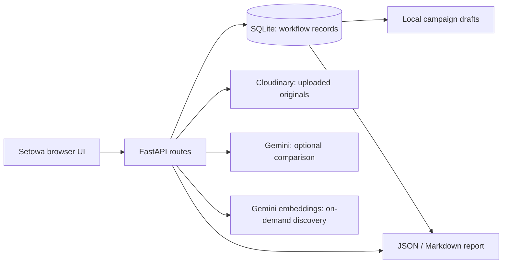

# Setowa architecture

Setowa is a small FastAPI application with a browser UI. Its trust boundary is simple: the browser displays evidence and submits decisions; the server validates pairs, owns review state, and builds reports from persisted records.

## Components

| Area | Location | Responsibility |
| --- | --- | --- |
| Showcase | `showcase/` | Product story and entry to the workspace; no analytical claims generated here. |
| Workspace | `backend/app/demo/` | Setup, project navigation, visits, evidence selection, review, and report UI. |
| API | `backend/app/routes/` | Local setup, media upload, evidence workflow, health, and legacy analysis routes. |
| Workflow store | `backend/app/services/evidence_store.py` | SQLite schema, persisted records, and revision events. |
| Comparison | `backend/app/services/image_comparison.py` | Optional Gemini image comparison and explicit unreliable results. |
| Media | `backend/app/services/media.py` | Validated, signed Cloudinary upload; original asset identifiers and URLs. |
| Reviewer auth | `backend/app/services/reviewer_auth.py` | Named reviewer tokens and loopback-only demo sessions. |
| Semantic discovery | `backend/app/services/semantic_search.py` | Builds project-scoped text records, caches Gemini embeddings in SQLite, ranks natural-language queries, and returns source links and review labels. |
| Campaign drafts | `backend/app/services/campaign.py` | Saves three copy formats from approved observations and sourced measurements; marks drafts stale when sources change. |

## Data and request flow

1. A site contains dated visits. Each uploaded asset belongs to a visit and keeps its Cloudinary public ID, version, secure URL, and source label.
2. Pair creation checks that assets differ, belong to the same site, and have strictly ordered visit dates. A comparison may provide a draft or an explicit reliability reason.
3. The AI draft, working text, approved text, evidence IDs, review state, reviewer, timestamps, version, and revisions remain separate. Editing text or evidence invalidates approval. An outdated `expected_version` cannot approve a newer revision.
4. Report generation reads saved `approved` observations and their original evidence references. It does not ask the model to rewrite findings. Measurements are separate records with visit, quantity, unit, source, and recorder.
5. The seeded riverbank project uses local synthetic images marked `synthetic_demo`; it does not upload media or invoke Gemini.
6. Semantic search is user-triggered. The server embeds saved descriptions and records, never raw Cloudinary originals, and keeps a local vector cache keyed to current content and evidence. It fails clearly if Gemini is unavailable. AI descriptions are marked unreviewed.
7. Campaign generation never promotes an AI proposal into a claim: it reads only approved text and separately recorded quantities with supplied sources. The generated copy stays a local draft; source edits or revoked approvals make earlier drafts stale.

## Security and operating limits

- `credential.json`, `backend/.env`, virtual environments, and `backend/lex.sqlite3` are ignored local files. The setup API returns readiness flags, never provider secrets.
- The convenient browser session is restricted to loopback and is **not** production user authentication. Named tokens are suitable for the private prototype, not a public multi-tenant service.
- Uploaded photos are delivered through Cloudinary; only use media with permission for that delivery. Gemini receives selected images when configured.
- SQLite must be on persistent storage. Public hosting needs accounts, authorization, rate limits, backups, migrations, and a deployment review before it is safe to expose.
- The legacy `/api/v1/analyze` mock endpoint is separate from the cleanup-evidence workflow and must not be used as proof of a field comparison.
- The current release is local only. No invited-user or public production authentication is claimed. A separate, unmerged pilot branch exists for later evaluation.

## Validation

`cd backend && python -m pytest -q` exercises the API and workflow without real provider calls. A live-pair evaluation needs permissioned before/after media and careful human labels; see [the evidence API guide](backend/EVIDENCE_WORKFLOW.md). Passing unit tests or completing the synthetic walkthrough does not establish comparison accuracy on real sites.
