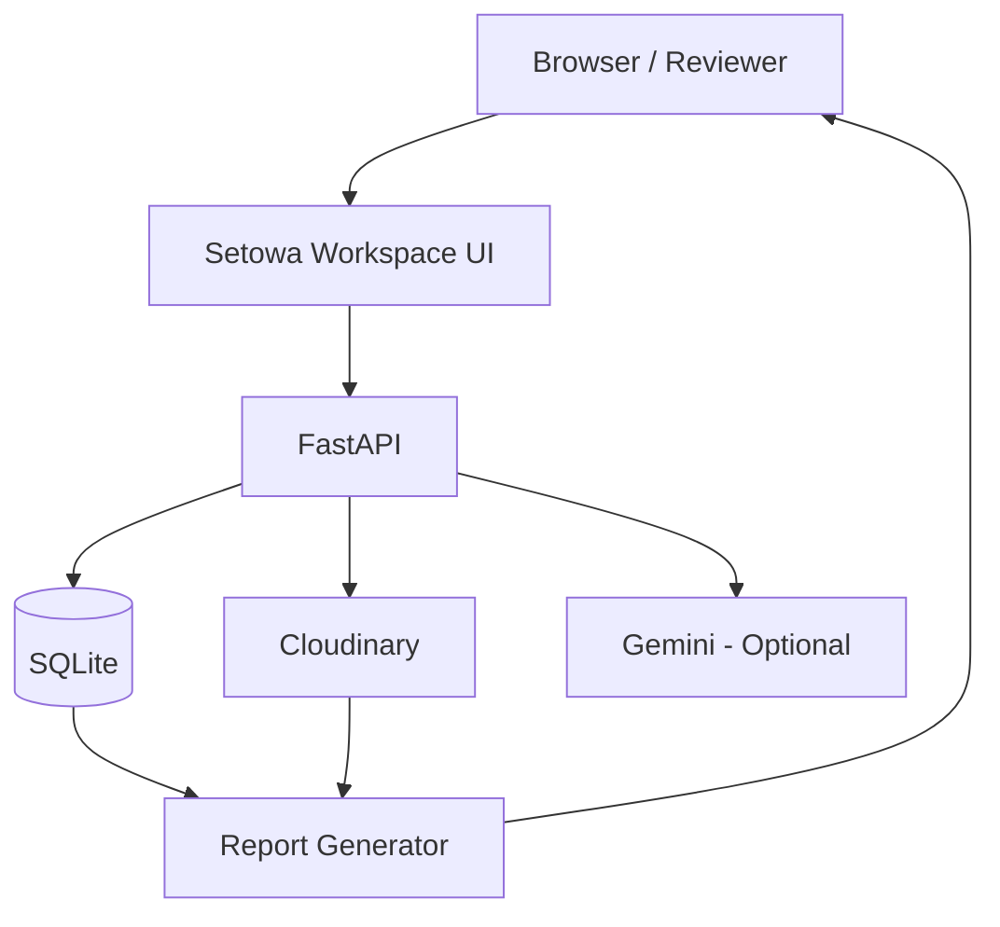

# LEX / Setowa — Master Architecture & Integration Specification

> **Source of truth:** integrated architecture for the current teammate implementation + LEX Milestone 1.
>
> **Product rule:** **AI proposes → evidence supports → human verifies → only approved records become reportable.**

## 1. Product

**Setowa** is the current product name; **LEX** remains the team/project name.

Core flow:

```text
Cleanup Site → Two Dated Visits → Permissioned Photos
→ Select Before/After → AI Comparison
→ Evidence-backed Draft → Human Review
→ Approve/Edit/Reject → Persist → Reload → Report
```

The existing implementation already contains FastAPI, browser UI, SQLite, Cloudinary upload, pair validation, optional Gemini comparison, revisions/version checks, reviewer tokens, synthetic demo data and approved-only reports. Preserve these capabilities; do not rebuild them. The current architecture explicitly makes the server authoritative for pair validation, review state and report generation. 

## 2. Product boundaries

### We ARE building
- Site and visit organization.
- Permissioned media references through Cloudinary.
- Manual before/after selection for Milestone 1.
- Cautious AI comparison.
- Evidence-linked observations.
- Human review: approve/edit/reject.
- Persistent review state and revision history.
- Reports generated only from saved approved records.
- Explicitly sourced measurements.

### We are NOT building yet
- Automatic pair discovery.
- Broad sustainability ontology.
- Automatic impact scoring.
- Multi-project analytics.
- Campaign/social content generation.
- General semantic media search.
- Complex video retrieval/RAG.
- Vector DB unless a concrete later requirement appears.
- Replacement of Cloudinary functionality.
- Production multi-tenant authentication.

The current team plan explicitly defers these until the core path is reliable.

## 3. Trust model

```text
AI draft             != human-approved statement
visual observation   != measured fact
confidence           != truth
synthetic evidence   != field evidence
```

Valid example:

> Less visible litter is present along the photographed section.

Invalid from photos alone:

> 35 kg of waste was collected.

A quantity must come from a separately recorded measurement with source, unit and recorder.

## 4. Current architecture



The browser displays evidence and submits decisions. The server validates pairs, owns review state and builds reports from persisted records.

## 5. Recommended codebase structure

Use this as the **target logical structure**. Do not perform a giant refactor just to achieve it; migrate incrementally as features are touched.

```text
LEX/
├── .ai/
│   ├── AGENTS.md
│   ├── PROJECT_STATE.md
│   ├── ARCHITECTURE.md
│   ├── DECISIONS.md
│   ├── TASK_BOARD.md
│   ├── HANDOFF.md
│   └── CHANGELOG.md
│
├── backend/
│   ├── app/
│   │   ├── main.py
│   │   ├── core/
│   │   │   ├── config.py
│   │   │   ├── logging.py
│   │   │   ├── errors.py
│   │   │   └── dependencies.py
│   │   ├── domain/
│   │   │   ├── enums.py
│   │   │   ├── site.py
│   │   │   ├── visit.py
│   │   │   ├── asset.py
│   │   │   ├── observation.py
│   │   │   ├── measurement.py
│   │   │   └── review.py
│   │   ├── schemas/
│   │   │   ├── sites.py
│   │   │   ├── visits.py
│   │   │   ├── assets.py
│   │   │   ├── comparison.py
│   │   │   ├── observations.py
│   │   │   ├── measurements.py
│   │   │   └── reports.py
│   │   ├── repositories/
│   │   │   ├── site_repository.py
│   │   │   ├── visit_repository.py
│   │   │   ├── asset_repository.py
│   │   │   ├── observation_repository.py
│   │   │   └── measurement_repository.py
│   │   ├── services/
│   │   │   ├── evidence_workflow.py
│   │   │   ├── image_comparison.py
│   │   │   ├── report_service.py
│   │   │   ├── reviewer_auth.py
│   │   │   └── media.py
│   │   ├── providers/
│   │   │   ├── cloudinary_provider.py
│   │   │   ├── gemini_provider.py
│   │   │   └── provider_status.py
│   │   ├── api/
│   │   │   ├── routes/
│   │   │   │   ├── health.py
│   │   │   │   ├── setup.py
│   │   │   │   ├── sites.py
│   │   │   │   ├── visits.py
│   │   │   │   ├── media.py
│   │   │   │   ├── evidence.py
│   │   │   │   ├── observations.py
│   │   │   │   ├── reports.py
│   │   │   │   └── legacy_analysis.py
│   │   │   └── router.py
│   │   ├── ui/
│   │   │   ├── pages/
│   │   │   ├── templates/
│   │   │   └── static/
│   │   ├── db/
│   │   │   ├── connection.py
│   │   │   ├── schema.py
│   │   │   └── migrations.py
│   │   ├── seed/
│   │   │   └── synthetic_project.py
│   │   └── demo/
│   ├── tests/
│   │   ├── unit/
│   │   ├── integration/
│   │   └── fixtures/
│   ├── scripts/
│   │   ├── check_cloudinary.py
│   │   ├── seed_demo.py
│   │   └── evaluate_pair.py
│   ├── EVIDENCE_WORKFLOW.md
│   └── pyproject.toml / requirements.txt
│
├── showcase/
├── docs/
│   ├── PRODUCT.md
│   ├── DEMO_SCRIPT.md
│   └── LIMITATIONS.md
├── run_local.sh
├── credential.example.json
├── .gitignore
└── README.md
```

**Current compatibility rule:** existing paths such as `backend/app/routes/`, `backend/app/services/`, `backend/app/demo/`, and `showcase/` remain valid. Only split large modules when a real feature requires it.

## 6. Layer responsibilities

### API routes
HTTP only. Parse input, authenticate, call a service, serialize output. No business policy or provider implementation.

### Services
Business workflows. `evidence_workflow.py` owns validation/review transitions; `image_comparison.py` owns comparison orchestration; `report_service.py` owns report construction.

### Providers
External systems only. Cloudinary provider owns upload/asset metadata. Gemini provider owns model invocation and response normalization.

### Repositories
Persistence access only. Do not put approval policy inside repositories.

### Domain
Stable business concepts independent of provider details.

### Schemas
API contracts. Do not expose DB internals directly.

## 7. Data model

### sites
```text
id
name
location
description
created_at
updated_at
```

### visits
```text
id
site_id
visit_date
label
created_at
updated_at
```

### assets
```text
id
visit_id
cloudinary_public_id
cloudinary_version
cloudinary_secure_url
resource_type
source_label
permission_status
created_at
```

### observations
```text
id
site_id
before_asset_id
after_asset_id
ai_status
ai_observation
ai_confidence
ai_limitations
working_text
approved_text
review_status
reviewed_by
reviewed_at
version
created_at
updated_at
```

### observation_revisions
```text
id
observation_id
version
previous_text
new_text
previous_evidence
new_evidence
changed_by
changed_at
reason
```

### measurements
```text
id
site_id
visit_id
quantity
unit
source
recorded_by
recorded_at
notes
```

## 8. Review state machine

```text
             ┌──────────┐
             │ PENDING  │
             └────┬─────┘
             approve│
                   ▼
             ┌──────────┐
             │ APPROVED │
             └────┬─────┘
          edit/evidence
                   │
                   ▼
             ┌──────────┐
             │ PENDING  │
             └──────────┘

PENDING ──reject──> REJECTED

Only APPROVED is reportable.
```

Editing approved text or evidence MUST reset the record to `pending`. Version checks must prevent stale approvals.

## 9. Pair validation

Server MUST enforce:

```text
before_asset != after_asset
before_asset.visit.site_id == after_asset.visit.site_id
before_visit.visit_date < after_visit.visit_date
```

Client-side checks are UX only.

## 10. AI comparison contract

```json
{
  "status": "supported",
  "observation": "Less visible litter is present along the photographed section.",
  "reasoning_summary": "The overlapping photographed area shows fewer visible litter items in the later image.",
  "confidence": 0.86,
  "limitations": []
}
```

Allowed status:

```text
supported
uncertain
insufficient_evidence
provider_unavailable
```

The AI must be able to decline when viewpoint, overlap, image quality or evidence is inadequate. Never expose chain-of-thought.

## 11. Report architecture

```text
DB
 ↓
SELECT observations WHERE review_status = APPROVED
 ↓
approved_text + evidence + explicit measurements
 ↓
Report renderer
```

Never send approved records back through an LLM to rewrite them. Rejected/pending claims must be impossible to enter the report through normal server paths.

## 12. Cloudinary boundary

Cloudinary owns original media, delivery, asset IDs/URLs, transformations and available media analysis.

Setowa owns sites, visits, application metadata, evidence relationships, review state, approved text, measurements and reports.

Do not duplicate original media unnecessarily.

## 13. Gemini boundary

Gemini is optional. Provider failure must become a controlled state and must not corrupt review data. Synthetic demo data must work without Gemini.

## 14. UI surfaces

```text
/showcase
/setup
/projects
/projects/{site_id}
/projects/{site_id}/visits
/compare
/review/{observation_id}
/report/{site_id}
```

The minimum demo is:

```text
Dashboard → Site → Visit → Compare → Review → Report
```

Evidence should be visually prominent; review state and source links must be obvious.

## 15. Testing

### Unit
- same-site pair accepted
- different-site pair rejected
- same asset rejected
- invalid date order rejected
- pending/approved/rejected transitions
- edit approved → pending
- evidence change approved → pending
- stale version rejected
- only approved records appear in reports
- original Cloudinary links preserved
- measurements require explicit source

### Integration

```text
create site
→ create visits
→ attach assets
→ select pair
→ compare
→ persist
→ approve
→ reload
→ export
```

Also test invalid pairs, rejected claims, provider-unavailable behavior and report integrity.

## 16. Security

Keep Cloudinary/Gemini secrets server-side and out of Git. Current loopback reviewer sessions/tokens are prototype controls, not production multi-tenant auth. Public deployment would need proper auth, authorization, rate limits, backups, migrations and operations review.

## 17. Code-size rules

```text
Ideal file:          100–250 LOC
Acceptable:          250–400 LOC
Refactor candidate:  400–600 LOC
Avoid:               >600 LOC

Ideal function:      <30 lines
Acceptable:          <50 lines
Refactor candidate:  >75 lines

Route handler:       preferably <20–30 lines
```

Prefer cohesive modules over giant `app.py`, `utils.py` or `services.py` files.

## 18. Agent ownership

### Antigravity
Architect, technical lead, reviewer and integrator.

Owns architecture, `.ai/` state, review, task decomposition, scope control and integration.

### Cline
Primary builder.

Owns scoped implementation tasks, tests, commits and handoffs.

### Git flow

```text
main
 ↑
dev
 ↑
feature branch
 ↑
Cline implementation
 ↓
PR
 ↓
Antigravity review
 ↓
merge
```

Never let two agents rewrite the same core module simultaneously.

## 19. Shared control plane

```text
.ai/
├── AGENTS.md
├── PROJECT_STATE.md
├── ARCHITECTURE.md
├── DECISIONS.md
├── TASK_BOARD.md
├── HANDOFF.md
└── CHANGELOG.md
```

`PROJECT_STATE.md` = what works/broken/next.
`TASK_BOARD.md` = ownership.
`DECISIONS.md` = why.
`HANDOFF.md` = next-agent context.
`ARCHITECTURE.md` = responsibility boundaries.
`CHANGELOG.md` = recent changes.

## 20. Definition of done

```text
Create cleanup site
→ create earlier visit
→ create later visit
→ upload permissioned photos
→ select valid pair
→ AI comparison OR explicit refusal
→ inspect evidence
→ approve/edit/reject
→ reload
→ approved state persists
→ export report
→ report contains ONLY approved text,
  original evidence links,
  and explicitly sourced measurements
```

## 21. Final engineering principle

Do not optimize for feature count. Optimize for this traceable chain:

```text
ORIGINAL MEDIA
    ↓
AI PROPOSAL
    ↓
SUPPORTING EVIDENCE
    ↓
HUMAN VERIFICATION
    ↓
PERSISTED APPROVAL
    ↓
TRACEABLE REPORT
```
