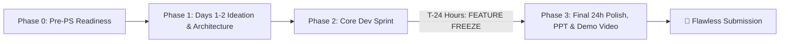

# 📋 Master Execution & Time Management Plan — Team LEX

> **Event:** Code Cubicle (HackCulture)  
> **Team:** Aryan Vishwakarma (Lead), Farhan Akhtar, Shubh Gunjan  
> **Core Philosophy:** *Hackathons are won in the last 24 hours — not by coding more features, but by flawless presentation, working live demos, and compelling storytelling.*

---

## 🧭 Core Strategy: The 4-Phase Game Plan

---

## Phase 0: Pre-PS Readiness (Immediate Actions)

Before the Problem Statement is published, do all administrative and scaffolding work so zero hackathon hours are wasted on setup:

- [ ] **Collaborator Access:** Ensure Farhan and Shubh have accepted the GitHub invitation to `LEX`.
- [ ] **Accounts & Free Credits Ready:**
  - **Hosting:** Vercel / Netlify / Render accounts verified.
  - **Database:** Supabase / Firebase project initialized.
  - **AI APIs:** Gemini API key (Google AI Studio), Groq / OpenAI keys ready with credits.
  - **Design & Pitch:** Figma / Canva / Google Slides templates ready.
  - **Screen Recording:** OBS Studio or Loom installed & tested on at least two teammates' laptops.
- [ ] **Boilerplate Warm-up:** Everyone tests running a basic React/Vite/Next.js frontend and Python/Node backend locally.

---

## Phase 1: Days 1–2 — Idea Discussion & System Design

*Do not write a single line of production code until the problem, solution, and architecture are crystal clear.*

### 1. The Winning Idea Selection Filter
When the PS drops, use the **4-Pillar Scorecard** to evaluate ideas:
1. **Direct Problem Alignment:** Does it solve what the PS is explicitly asking for?
2. **"Demo-ability" (Visual Wow Factor):** Can a judge understand and be impressed within 30 seconds of seeing the screen?
3. **Technical Depth:** Does it involve intelligent logic, AI, real-time data, or scalable architecture (not just a basic CRUD app)?
4. **Feasibility in Time:** Can an MVP be completed 24 hours before the deadline by 3 people?

### 2. MoSCoW Feature Scoping
Divide planned features into 4 strict buckets:
- **Must Have (MVP):** 2–3 core features that complete the primary user story. (Without this, the project fails).
- **Should Have:** 1–2 differentiating features that elevate the project above competitors.
- **Could Have:** Delight features (dark mode, sound effects, complex analytics) — *only touch if ahead of schedule*.
- **Won't Have:** Cool ideas that take >6 hours. *Instantly discarded for the hackathon.*

### 3. Contract-First Architecture
- Define **API endpoints and JSON schemas** (Request & Response) on Day 1.
- Frontend can build against mock JSON data immediately while Backend builds the real endpoints in parallel.
- Avoids the common trap where Frontend waits idle for Backend to finish!

---

## Phase 2: Core Development Sprint (Until T-minus 24h)

### Work Stream Separation
- **Track 1 (Lead & Architecture — Aryan):** Full-stack glue, database integration, core business logic, code reviews, deployment pipeline.
- **Track 2 (Backend / AI / Engine — Farhan):** API routes, third-party integrations, AI prompt engineering/models, data processing.
- **Track 3 (Frontend / UI / Polish — Shubh):** Client interfaces, responsive UI components, user flow interactions, showcase landing page.

*(Note: Roles can flex depending on the exact problem statement, but everyone must own a distinct layer).*

### Daily Integration Rhythm
- **Morning Sync (15 mins):** What did I complete? What am I doing today? Any blockers?
- **Midday Checkpoint (10 mins):** Are we on track with API contracts?
- **Nightly Merge & Staging Deployment:** Merge feature branches into `dev`, deploy to Vercel/Render, test live.

---

## Phase 3: The Golden Rule — Feature Freeze (T-Minus 24 Hours)

> [!IMPORTANT]
> **Strict Rule:** All feature development stops exactly 24 hours before the official submission deadline.
> Even if a feature is 90% done — if it is not working reliably by T-minus 24h, comment it out and hide the button. A polished 2-feature app beats a broken 5-feature app 100% of the time.

### What Happens in the Final 24 Hours:

### 1. Bug Squashing & UX Polish (Hours 24 to 18 before deadline)
- Remove `console.log` errors and broken layout bugs.
- Add realistic dummy data so the app looks populated and active (no empty tables or blank charts).
- Add loading states (spinners/skeletons) and clear success/error toasts.
- Ensure the app is responsive and works cleanly on modern browsers.

### 2. Live Demo Video Production (Hours 18 to 12 before deadline)
- Follow [DEMO_VIDEO_SCRIPT.md](./SUBMISSION_KIT/DEMO_VIDEO_SCRIPT.md).
- Keep length strictly between **2 to 3 minutes** (judges stop watching after 3 mins).
- Script structure:
  - 0:00–0:25: Hook & the real-world pain point.
  - 0:25–1:45: Live screen recording showing the core user flow in action.
  - 1:45–2:15: Architecture, AI integration, and technical innovation.
  - 2:15–2:45: Future roadmap, market impact, and closing.
- Edit with clear captions, zoom-ins on key features, and background music at low volume.
- Upload to YouTube as **Unlisted / Public** and verify audio playback.

### 3. Presentation Pitch Deck / PPT (Hours 12 to 6 before deadline)
- Follow [PPT_OUTLINE.md](./SUBMISSION_KIT/PPT_OUTLINE.md).
- Keep it to **8–10 high-impact visual slides**.
- Use product screenshots, architecture diagrams, and metrics rather than walls of text.

### 4. Showcase Landing Page / Web Presentation
- If the main project is a mobile app, CLI, or backend service: deploy a high-converting web landing page explaining the product with demo links and download buttons.
- If the project is a web app: ensure the landing page has a clear "Try Live Demo" button with pre-filled test credentials.

### 5. Final Submission Review (Hours 6 to 2 before deadline)
- Run through [SUBMISSION_CHECKLIST.md](./SUBMISSION_KIT/SUBMISSION_CHECKLIST.md).
- Submit **at least 2 hours before the portal closes** to guard against portal server crashes, slow Wi-Fi, or form timeouts.

---

## 🛡️ Risk Management & Contingencies

| Scenario / Risk | Prevention / Fallback Plan |
| :--- | :--- |
| **External AI/API rate limited or down** | Build a fallback mock-response toggle in the backend (`USE_MOCK=true`) so the live demo never crashes. |
| **Backend integration takes too long** | Frontend uses static JSON fixtures in localStorage to demonstrate complete UI/UX flow. |
| **Merge conflict disaster near deadline** | No one pushes directly to `main`. Aryan oversees merges to `dev`. Feature freeze ensures code stability. |
| **Live demo fails during presentation** | Pre-record a backup 60-second screen capture GIF/MP4 of the working flow embedded directly into the PPT. |
| **Submission portal crashes at deadline** | We submit 2–3 hours early. We draft all submission texts in a markdown file first. |

---

## 🏆 Scoring Rubric Alignment

Hackathon judges typically evaluate on:
1. **Relevance to Problem Statement (25%):** Directly addressed via Phase 1 scoping.
2. **Innovation & Originality (20%):** Highlighted in PPT & Demo video Hook.
3. **Technical Complexity & Architecture (25%):** Shown via clean architecture diagrams, API integration, and code quality in repo.
4. **UI/UX & User Experience (15%):** Polished during the 24h freeze window.
5. **Presentation & Pitch (15%):** Secured by dedicated deck, video, and landing page polish.
