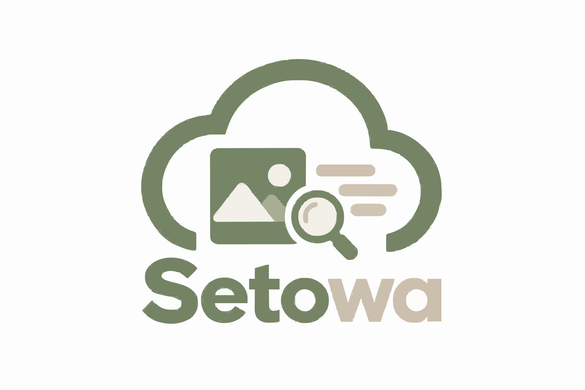

<p align="center">
  
</p>

# Setowa — Evidence Intelligence for Impact

> **Built by Team LEX (Local Evidence eXchange)** · Cloudinary × Google Gemini Hackathon 2026

**LEX** is the architectural framework and engineering project developed for the Cloudinary × Google Gemini Hackathon 2026. Its reference platform is **Setowa** — an evidence intelligence system that bridges physical field cleanup operations and trustworthy, audit-ready public reporting.

Coordinators upload photos and videos from field visits; AI proposes visual observations and video frame analytics; human reviewers verify them; only human-verified evidence reaches official reports and public impact stories.

---

## The problem

Environmental cleanup organisations run dozens of concurrent field sites. Photos pile up in phone galleries. Comparison is manual. Reporting is anecdotal. There is no systematic way to show *what changed*, *when*, *who verified it*, and *what the evidence actually is*.

---

## What Setowa does

| Stage | What happens |
|---|---|
| **Field Media** | Photos and videos uploaded directly to Cloudinary from the workspace |
| **Organise** | Assets grouped by Project → Site → Visit with spatial and temporal metadata |
| **AI Understanding** | Gemini analyses individual assets and before/after pairs; produces proposals, tags, and signals |
| **Compare** | Side-by-side and split-reveal slider for visual before/after comparison |
| **Human Verify** | Reviewer approves, edits, or rejects every AI proposal. Editing resets approval. |
| **Report** | Only approved observations with approved text appear in exports |
| **Impact Story** | Gemini generates a grounded narrative; published publicly via a share token |

**Trust model:**

```
AI PROPOSES  →  EVIDENCE SUPPORTS  →  HUMAN VERIFIES  →  APPROVED RECORD  →  TRACEABLE REPORT
```

AI is a proposal engine, not a source of truth. No observation is ever auto-approved.

---

## Key features

- **Cloudinary Programmable Media** — original upload, auto format/quality delivery (`f_auto,q_auto`), responsive previews, video poster frames at custom offsets (`so_<ts>`), derived thumbnails
- **Bulk ingestion** — multi-file upload with per-file error isolation; CLI utility for offline ingestion
- **Media Library** — type/permission/tag/signal filtering, inline HTML5 video playback, lightbox inspection
- **AI Media Intelligence** — per-asset visual description, controlled tags and signals, grounded in Cloudinary URLs via Gemini multimodal API
- **Video Frame Analytics** — deterministic frame sampling (interval / uniform / custom timestamps), Cloudinary offset transformations, per-frame Gemini observation, aggregated video summary
- **Before/After Evidence** — chronological pair validation (same site, correct date order, distinct assets, permission check), split-reveal comparison slider
- **Skill Runtime** — versioned, declarative skills (`media-metadata@1.0.0`, `evidence-comparison@1.0.0`, `media-intelligence@1.0.0`, `field-frame-observation@1.0.0`) with typed manifests, permission enforcement, 4-state contracts
- **Visual Workflow Builder** — DAG composer connecting skills into pipelines, topological execution, failure propagation, visual SVG canvas
- **Human Review** — approve / edit / reject; optimistic-lock versioning (409 on stale); editing any field resets approval to pending; reviewer identity from server token, not payload
- **Deterministic Reports** — zero LLM calls; only approved observations with approved text; Cloudinary URLs preserved; sourced measurements require named reviewer
- **Sustainability Timeline + Impact Story** — chronological event log, before/after proof cards, Gemini grounded narrative (refuses invented metrics), deterministic offline fallback
- **Public Share** — 128-bit token, published-only gating (draft/in_review → 404), public data projection strips all internal IDs and tokens, Open Graph meta, print stylesheet
- **Semantic Search + FTS5 Fallback** — explicit bounded indexing (≤ 24 docs); provider failure silently falls back to SQLite FTS5 keyword search; result mode always labeled
- **CSP / Security Headers** — no inline event handlers; delegated JS navigation; `X-Content-Type-Options`, `X-Frame-Options`, `Referrer-Policy`, strict CORS
- **Production guard** — startup blocked in production mode until authentication gates are implemented

---

## End-to-end workflow

```
Showcase  →  Workspace  →  Project/Site  →  Media Library  →  Search
    →  AI Intelligence  →  Timeline  →  Before/After  →  AI Proposal
    →  Human Review  →  Approval  →  Report  →  Campaign  →  Public Impact Story
```

Each stage has a footer navigation guide in the demo workspace so a judge can follow the full pipeline without reading documentation.

---

## Architecture overview

```
Browser (Vanilla JS SPA)
    │
    ├── /demo/          ← Setowa Workspace (index.html + app.js)
    ├── /share/{token}  ← Public read-only impact story (server-rendered HTML)
    └── /api/v1/        ← FastAPI JSON API
            │
            ├── Evidence store (SQLite / PostgreSQL)
            │       Sites → Visits → Assets → Observations → Reviews → Reports
            │
            ├── Skill Runtime  ← versioned skills + permission enforcement
            │       └── DAG Workflow Engine  ← topological execution
            │
            ├── Cloudinary SDK  ← upload, delivery, video frame derivation
            │
            └── Gemini API  ← visual intelligence, narrative synthesis
                    (optional; all manual workflows function without it)
```

See [`.ai/ARCHITECTURE.md`](.ai/ARCHITECTURE.md) for core invariants and the [root `ARCHITECTURE.md`](ARCHITECTURE.md) for provider and persistence details.

---

## Tech stack

| Layer | Technology |
|---|---|
| Backend | Python 3.12+, FastAPI, Uvicorn |
| Database | SQLite (default), PostgreSQL (optional, via `DATABASE_URL`) |
| Media Storage | Cloudinary (Python SDK `cloudinary==1.46.2`) |
| AI / Vision | Google Gemini (`gemini-flash-latest`) via `google-generativeai` |
| AI / Search | Optional NVIDIA embedding adapter (FTS5 fallback when unavailable) |
| Frontend | Vanilla HTML/CSS/JavaScript (no build step) |
| Tests | pytest (317 passing, 2 skipped live-only, 1 known Windows chmod failure) |

---

## Cloudinary integration

Cloudinary is the primary media backbone, not an optional add-on:

| Feature | Implementation |
|---|---|
| Upload | `POST /api/v1/media/upload` — server-side SDK, never exposes credentials to browser |
| Bulk upload | `POST /api/v1/media/bulk` — per-file error isolation |
| Delivery | `f_auto,q_auto` auto format/quality; `w_1200,h_900,c_limit` previews; `w_640,h_480` thumbnails |
| Video poster | `so_0.jpg` frame at upload time |
| Video frame extraction | `so_<timestamp>.jpg` derived transformations — no local video re-encoding |
| AI vision | Cloudinary delivery URLs passed directly to Gemini multimodal API |
| Provenance | Original Cloudinary URLs preserved end-to-end in reports and public stories |
| Permission gate | Assets with `permission_status != 'granted'` excluded from AI analysis and reports |

The demo runs without a Cloudinary key by relying on pre-seeded Cloudinary URLs in the local database.

---

## Gemini integration

| Feature | Implementation |
|---|---|
| Media intelligence | `media-intelligence@1.0.0` skill — per-asset description, tags, signals |
| Frame observation | `field-frame-observation@1.0.0` skill — per-frame visual observation |
| Before/after comparison | `evidence-comparison@1.0.0` skill — 4-state output (`changed` / `unchanged` / `uncertain` / `insufficient_evidence`) |
| Impact narrative | `POST /api/v1/projects/{id}/impact-story` — grounded narrative, refuses invented metrics, deterministic fallback offline |
| Confidence | Bounded [0.0, 1.0]; distinguished from accuracy; displayed with uncertainty caveats |
| Hallucination guard | Structured output schema; unverified quantitative claims (weights, counts, percentages) explicitly rejected |

---

## Evidence / AI / human-review model

1. **AI proposes** — Gemini produces a structured visual observation. `review_status = pending`.
2. **Human verifies** — Reviewer reads the proposal and the side-by-side evidence, then approves, edits, or rejects.
3. **Edit invalidates** — Any change to observation text or evidence resets status to `pending` immediately.
4. **Optimistic lock** — Every review mutation requires a matching `version`; stale writes return `409 Conflict`.
5. **Report generation** — Queries only `review_status = 'approved'` + `approved_text` records. Zero LLM calls.
6. **Measurements** — Require a named human reviewer and an explicit non-blank source reference.

No AI output reaches a report or public story without passing through this human gate.

---

## Demo instructions

### Prerequisites

- Python 3.10+
- A Cloudinary account (optional — pre-seeded media URLs work locally)
- A Gemini API key (optional — all manual review workflows function without it)

### 1. Clone and start (Linux / macOS)

```bash
git clone https://github.com/farhanakhtar0x66/LEX.git
cd LEX
./run_local.sh
```

Open **http://127.0.0.1:8000/demo/**

### 2. Windows

```powershell
cd backend
python -m venv venv
.\venv\Scripts\pip install -r requirements.txt
python scripts\seed_demo.py
python scripts\start_demo.py
```

### 3. Demo walkthrough

The demo workspace is pre-loaded with synthetic data across 4 sites. No AI key is required to walk the full evidence pipeline using the pre-seeded comparison pairs.

Follow the footer navigation, or use this sequence manually:

```
Showcase → Workspace → open a project → Media Library
→ Search → AI Intelligence → Timeline → Before/After
→ AI Proposal → Human Review → Approval → Report → Campaign → Public Story
```

See [`docs/DEMO_RUNBOOK.md`](docs/DEMO_RUNBOOK.md) for the step-by-step judge guide with safety guidelines.

---

## Environment variables

Copy `backend/.env.example` → `backend/.env` and fill in only what you need:

```env
# Required for real uploads
CLOUDINARY_CLOUD_NAME=
CLOUDINARY_API_KEY=
CLOUDINARY_API_SECRET=

# Required for AI analysis (optional — demo works without it)
GEMINI_API_KEY=
GEMINI_MODEL=gemini-flash-latest

# Reviewer token for the local pilot (min 32 chars)
REVIEWER_TOKENS={"YourName":"replace-with-32-random-chars"}

# Optional PostgreSQL (SQLite is the default)
DATABASE_URL=

# Optional NVIDIA embedding (FTS5 keyword search is the fallback)
NVIDIA_API_KEY=
```

**Never commit real secrets.** `credential.json`, `.env`, and `*.sqlite3` are in `.gitignore`.

---

## Testing

```bash
# Full test suite
backend/venv/Scripts/python -m pytest backend/tests -q

# JS syntax check
node --check backend/app/demo/app.js

# End-to-end smoke test (9 stages)
backend/venv/Scripts/python -m pytest backend/tests/test_e2e_journey.py -v

# Local search benchmark (no live keys needed)
backend/venv/Scripts/python backend/scripts/benchmark_discovery.py
```

**Known Windows issue:** `test_local_setup.py` fails with a `chmod 0o600` assertion — Windows NTFS does not honour POSIX permission bits. The application code is correct; this test passes on Linux CI.

Live integration tests (real Cloudinary + Gemini) are gated by `RUN_LIVE_INTEGRATION=1` and skip cleanly otherwise.

---

## Project structure

```
LEX/
├── README.md                    ← this file
├── ARCHITECTURE.md              ← provider and persistence details
├── DEPLOYMENT.md                ← Render / PostgreSQL deployment guide
├── DEMO.md                      ← quick demo reference
├── EVALUATION.md                ← AI evaluation methodology
├── SECURITY.md                  ← security principles
├── run_local.sh                 ← one-command local startup (Linux/macOS)
│
├── .ai/                         ← team documentation
│   ├── ARCHITECTURE.md          ← core invariants and trust model
│   ├── DECISIONS.md             ← architecture decision log (D001–D021)
│   ├── PROJECT_STATE.md         ← verified test baseline and feature checklist
│   ├── TASK_BOARD.md            ← milestone history (T001–T022)
│   ├── HANDOFF.md               ← agent handoff and session state
│   └── CHANGELOG.md             ← incremental change log
│
├── backend/
│   ├── app/
│   │   ├── main.py              ← FastAPI app, routes, CSP headers
│   │   ├── demo/                ← Workspace SPA (index.html, app.js, styles.css)
│   │   ├── providers/           ← Cloudinary, Gemini, NVIDIA adapters
│   │   ├── skills/              ← Skill Runtime (models, registry, runtime, built-ins)
│   │   ├── workflows/           ← DAG Engine (graph, executor, persistence)
│   │   └── evidence_store.py    ← SQLite / PostgreSQL evidence store
│   ├── scripts/
│   │   ├── seed_demo.py         ← idempotent demo database seed
│   │   ├── start_demo.py        ← one-command server launcher
│   │   └── migrate_postgres.py  ← PostgreSQL schema initialiser
│   ├── tests/                   ← pytest suite (317 tests)
│   ├── .env.example             ← environment variable reference
│   └── requirements.txt
│
├── docs/
│   ├── DEMO_RUNBOOK.md          ← step-by-step judge guide
│   └── CLOUDINARY_STATUS.md     ← Cloudinary integration status
│
└── showcase/                    ← public showcase landing page
```

---

## Security and trust principles

- **No credentials in browser** — Cloudinary secrets and reviewer tokens live only on the server.
- **Provider error redaction** — External API errors are sanitised before reaching the client.
- **Permission gate** — Assets with `permission_status != 'granted'` are excluded from AI analysis and all public outputs.
- **Published-only public access** — Draft and in-review stories return `404` without leaking their existence.
- **No auto-approval** — AI proposals are permanently `pending` until a human reviewer acts.
- **Edit invalidation** — Changing any observation field immediately resets its approval state.
- **Optimistic locking** — Concurrent review mutations are rejected with `409 Conflict`.
- **Production guard** — The application refuses to start in production mode without full authentication.
- **CSP compliance** — No inline `onclick` handlers; all navigation uses delegated event listeners.

---

## Known limitations

- Full account authentication (password login, admin/reviewer/viewer roles, CSRF, rate limiting) is **not implemented**. The current pilot uses a shared reviewer token.
- The production mode startup guard is active — the system cannot be deployed as a public multi-user service in its current state.
- SQLite on a free Render filesystem is ephemeral (data lost on restart/redeploy). PostgreSQL is supported via `DATABASE_URL`.
- NVIDIA embeddings are optional. Live NVIDIA vision/embedding success has not been validated against a real permissioned field dataset.
- Synthetic demo media (riverbank images) is illustrative only. It is not real field impact.
- Windows: `chmod 0o600` is not honoured by NTFS. The related test is a known baseline failure, not a code defect.

---

## Navigation — `.ai/` documentation

| Document | Purpose |
|---|---|
| [`.ai/ARCHITECTURE.md`](.ai/ARCHITECTURE.md) | Core invariants, trust model, storage principles |
| [`.ai/DECISIONS.md`](.ai/DECISIONS.md) | Architecture decision log D001–D021 |
| [`.ai/PROJECT_STATE.md`](.ai/PROJECT_STATE.md) | Verified test baseline, full feature checklist |
| [`.ai/TASK_BOARD.md`](.ai/TASK_BOARD.md) | Milestone history T001–T022 |
| [`.ai/HANDOFF.md`](.ai/HANDOFF.md) | Agent handoff notes and session state |
| [`.ai/CHANGELOG.md`](.ai/CHANGELOG.md) | Incremental change log |

---

## References

- [Cloudinary Python SDK](https://cloudinary.com/documentation/python_integration)
- [Cloudinary Programmable Media](https://cloudinary.com/documentation/image_transformations)
- [Google Gemini API](https://ai.google.dev/gemini-api/docs)
- [`DEPLOYMENT.md`](DEPLOYMENT.md) — Render + PostgreSQL deployment
- [`EVALUATION.md`](EVALUATION.md) — AI evaluation methodology and honesty principles
- [`SECURITY.md`](SECURITY.md) — security model and outstanding gates
- [`docs/DEMO_RUNBOOK.md`](docs/DEMO_RUNBOOK.md) — step-by-step judge walkthrough

---

*Setu: bridge. Wa: harmony. Built by Team LEX.*
